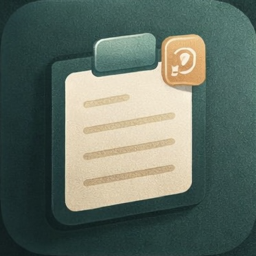

<div align="center">



# Cliply

[](https://github.com/Luisdergoat/Quick_Paste/releases/tag/Clipy)
[](https://github.com/Luisdergoat/Quick_Paste)
[](https://swift.org)
[](https://developer.apple.com/xcode/)
[](https://www.apple.com/macos/)

**A curated clipboard history manager that only saves what you intend to save.**

Cliply revolutionizes clipboard management on macOS by storing items only when you explicitly choose to — no more accidental history pollution.

</div>

---

## 📋 Table of Contents

1. [About The Project](#about-the-project)
2. [Features](#features)
3. [Installation](#installation)
4. [Keyboard Shortcuts](#keyboard-shortcuts)
5. [Building from Source](#building-from-source)
6. [Contributing](#contributing)
7. [License](#license)

---

## 🎯 About The Project

Most clipboard managers record **everything** you copy, creating a cluttered history filled with passwords, sensitive data, and temporary text you never wanted to keep.

**Cliply** takes a different approach: it only stores clipboard entries when you **intentionally** invoke **⌘⇧C**. Normal ⌘C works exactly as before — no surprises, no automatic tracking.

The result is a **focused, curated history** of only the things you actually meant to save.

**Built entirely with SwiftUI, Cliply is fast, lightweight, and feels like a native extension of macOS.**

[Back to top ⬆️](#-table-of-contents)

---

## ✨ Features

### 🎯 Curated Clipboard History
Only stores items when you press **⌘⇧C** — normal **⌘C** works unchanged.

### ⚡ Lightning-Fast Access
Press **⌘⇧V** to instantly view your last 3 clipboard items in a beautiful popup.

### ⌨️ Full Keyboard Navigation
**Tab** to navigate, Return to paste — never touch your mouse.

### 📚 Expandable History
Press **H** at the top to reveal your full clipboard history (up to 10 items).

### 🎨 Native macOS Design
- Frosted-glass background
- Smooth spring animations
- Rounded corners
- Dark mode support

### 🔒 Privacy-First
- No cloud sync
- No network access
- All data stored locally
- You control what gets saved

### 🚀 Menu Bar Only
No Dock icon — Cliply stays out of your way until you need it.

[Back to top ⬆️](#-table-of-contents)

---

## 📥 Installation

### Option 1: Download DMG (Recommended)

1. **[Download the latest DMG](https://github.com/Luisdergoat/Quick_Paste/releases/tag/Clipy)**
2. Open the DMG file
3. Drag **Cliply.app** to your Applications folder
4. Launch Cliply from Spotlight or Applications
5. Grant accessibility permissions when prompted

### Option 2: Homebrew (Coming Soon)

```bash
# Add the tap
brew tap luisdergoat/cliply

# Install Cliply
brew install --cask cliply
```

[Back to top ⬆️](#-table-of-contents)

---

## ⌨️ Keyboard Shortcuts

| Shortcut | Action |
|----------|--------|
| ⌘C | Normal copy — **not** stored in history |
| **⌘⇧C** | History copy — copies selection **and** saves to history |
| ⌘V | Normal paste the last thing copied |
| **⌘⇧V** | Show clipboard history popup |
| Tab | Move selection down in popup |
| Return | Paste selected item |
| Escape | Dismiss popup |


[Back to top ⬆️](#-table-of-contents)

---

## 🛠️ Building from Source

### Prerequisites

- macOS 13 Ventura or later
- Xcode 15 or later
- An Apple Developer account (for code signing)

### Build Steps

1. **Clone the repository**

   ```bash
   git clone https://github.com/luisdergoat/cliply.git
   cd cliply
   ```

2. **Open in Xcode**

   ```bash
   open cliply.xcodeproj
   ```

3. **Configure code signing**

   - Select the **Cliply** target in Xcode
   - Go to **Signing & Capabilities**
   - Select your development team

4. **Build & Run**

   Press **⌘R** or click the Run button. Cliply will appear in your menu bar.

5. **Grant accessibility permissions**

   On first launch, you'll be prompted to grant accessibility permissions:
   - Open **System Settings** → **Privacy & Security** → **Accessibility**
   - Add **Cliply** to the allowed list
   - Relaunch the app

### Creating a DMG for Distribution

```bash
# Run the build script
./scripts/build_dmg.sh
```

This will create a **Cliply.dmg** file ready for distribution.

[Back to top ⬆️](#-table-of-contents)

---

## 🤝 Contributing

Contributions are what make the open-source community such an amazing place to learn, inspire, and create. Any contributions you make are **greatly appreciated**.

### Ways to Contribute

- ⭐ **[Star on GitHub](https://github.com/luisdergoat/cliply)** - Help others discover Cliply
- 🐛 **[Report Issues](https://github.com/luisdergoat/cliply/issues)** - Help us improve the app
- 💡 **[Request Features](https://github.com/Luisdergoat/Quick_Paste/issues/new)** - Suggest new ideas
- 🔧 **Submit Pull Requests** - Contribute code improvements
- 📖 **Improve Documentation** - Help make the docs better

### Development Guidelines

1. Fork the repository
2. Create your feature branch (`git checkout -b feature/AmazingFeature`)
3. Commit your changes (`git commit -m 'Add some AmazingFeature'`)
4. Push to the branch (`git push origin feature/AmazingFeature`)
5. Open a Pull Request

[Back to top ⬆️](#-table-of-contents)

---

## 📜 License

This project is licensed under the **MIT License** - see the [LICENSE](LICENSE) file for details.

**Copyright © 2026 Luis der Goat**

[Back to top ⬆️](#-table-of-contents)

---

## 💖 Support the Project

If you find Cliply useful, consider supporting its development:

<div align="center">

[](https://github.com/sponsors/luisdergoat)

**Your support helps keep Cliply free and open source!**

</div>

---

## 🌟 Star History

If you like Cliply, don't forget to give it a star! ⭐

[](https://star-history.com/#luisdergoat/cliply&Date)

---

<div align="center">

**Made by [lunsold](https://github.com/luisdergoat)**

[Report Bug](https://github.com/Luisdergoat/Quick_Paste/issues)

</div>
